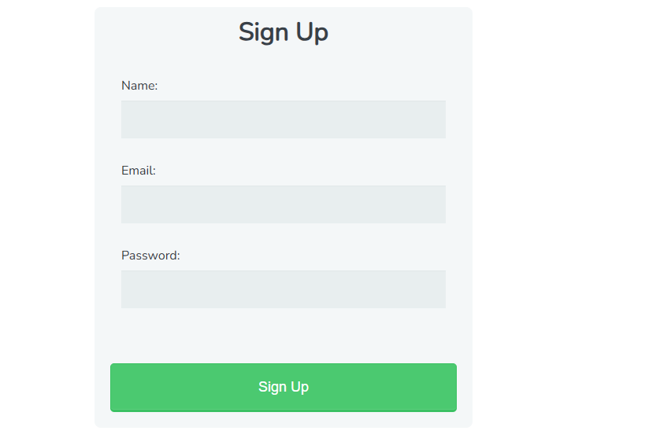
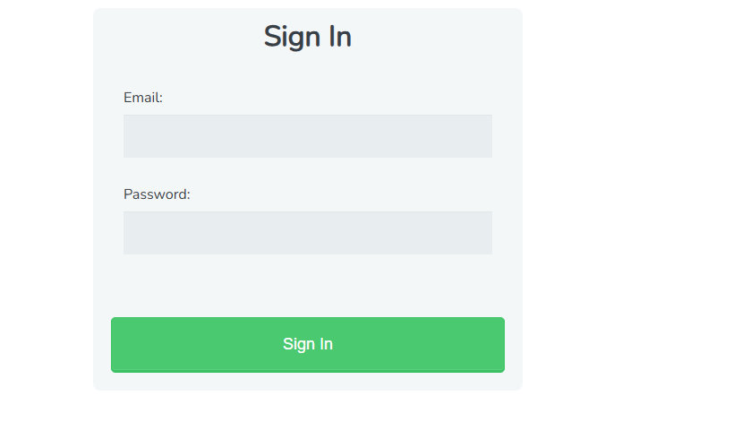

User trial & Subscription using Stripe

## Table of contents

-   [Overview](#overview)
-   [Steps](#Steps)
-   [Screenshot](#screenshot)
-   [Built with](#built-with)

## Overview

    - User trial and subscription functionality.
    - Here, the user can sign up, login, and subscribe to a trial plan. The user can also cancel their
      subscription and trial. After trial end original subscription will be activated.
    - User can also upgrade and downgrade their subscription.
    - The subscription will start from the next month or next year and from the date the subscription
      created to the next month start it will take the subscription amount by charge if the subscribing date is not the month or year first.
    - Not using stripe automatic calculation of subscription amount or automatic billing cycle instead
      calculate manually.

## Steps

    1. composer install
    2. npm install
    3. Copy .env.example to .env and place your datas and make a stripe account and place you secret key and publishable key and create a webhook and copy webhok signing key and all datas place in .env.
    Also create plans for monthly and yearly and copy the plan ids and store it in the subscription plans table.
    4. Create app key by running the command php artisan key:generate
    4. Plce the plan IDs in subscription seeder
    5. Run php artisan migrate
    6. Run php artisan db:seed
    7. Run php artisan serve

### Screenshot
Register

Login

Subscription page

Choose Plan

Buy Subscription 

Subscription page after subscribed

Home

## My process

-   User registartion and after login user redirected to susbcription page and if user not subscribed, user will stay on that page.
-   Only after susbcription user can move on to dashboard.
-   Otherwise if user go to dashboard, it will redirected subscription page

### Built with

-   Laravel
-   Bootstrap
-   Stripe
